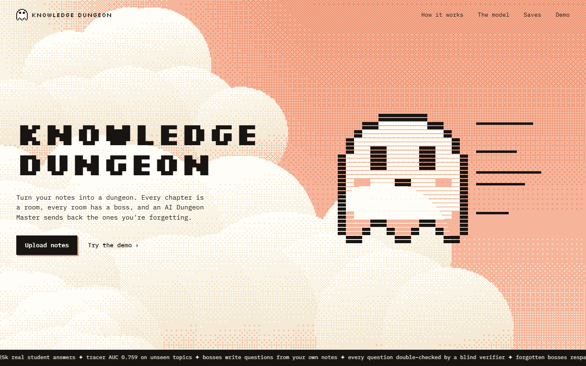
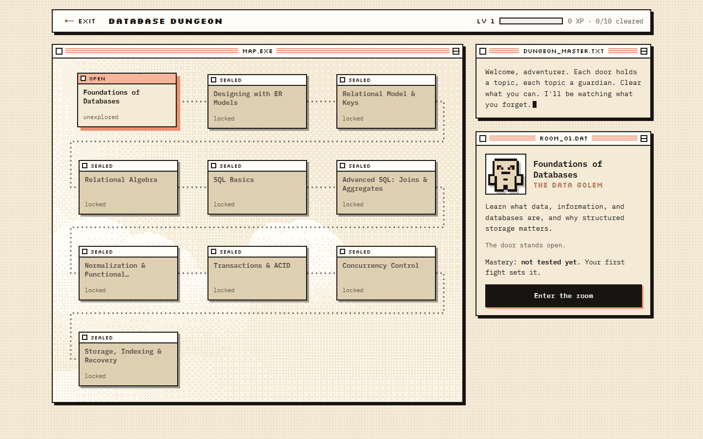
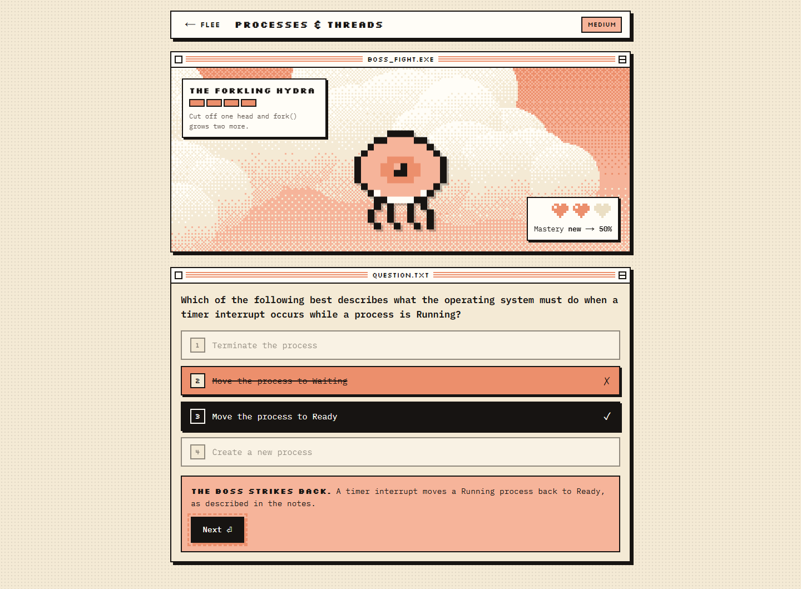
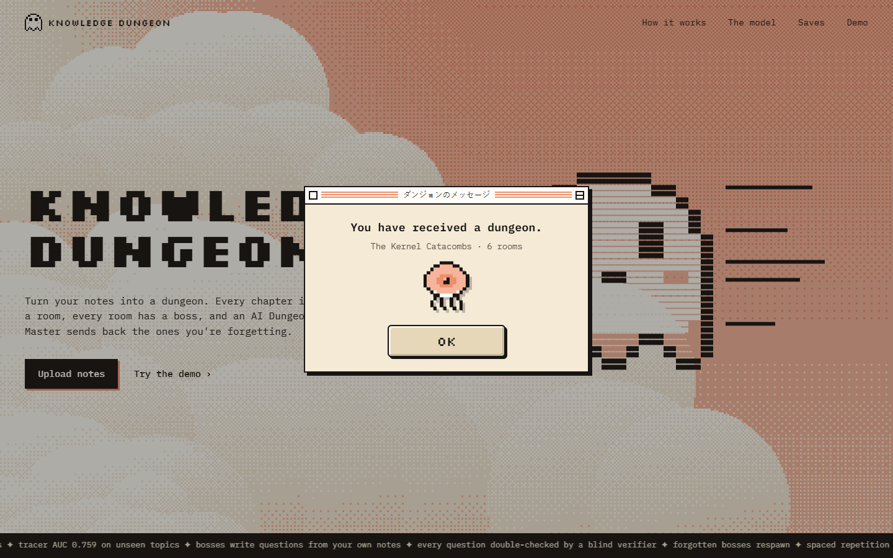
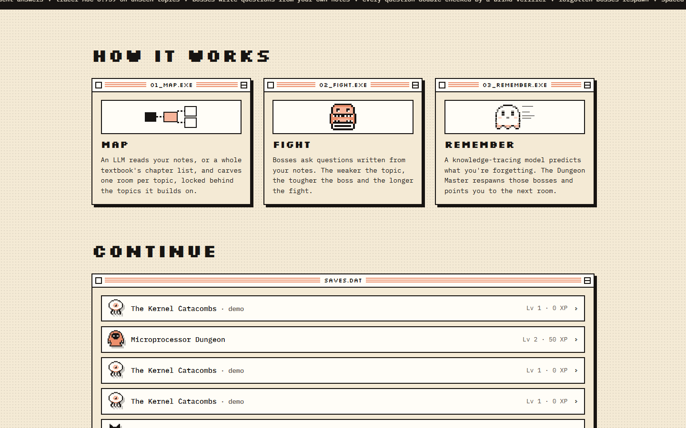
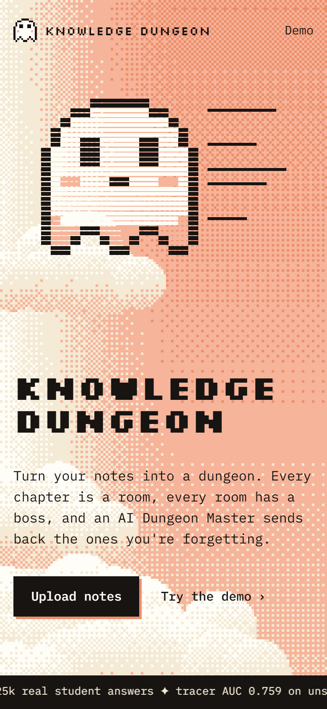

# ⚔️ Knowledge Dungeon

**Turn your notes into a dungeon. Beat the bosses. Remember everything.**

Upload your course notes and an AI Dungeon Master carves them into a dungeon: every topic is a room,
every room is guarded by a boss, and rooms unlock in the order the concepts build on each other.
Bosses fight with questions written from *your* notes. A knowledge-tracing model, trained on 325k real
student answers, estimates how well you know each topic. It sets each boss's difficulty and HP, and when
it predicts you're forgetting a topic you already cleared, the Dungeon Master **respawns that boss**.

Spaced repetition and adaptive practice, disguised as an RPG.



| | |
|---|---|
|  |  |
| **The map.** A 100-page DBMS book became 10 rooms, locked by prerequisites. | **A boss fight.** Questions come from your notes; HP and difficulty come from the tracer. |
|  |  |
| **New dungeon.** News arrives in retro pop-ups. | **How it works**, and your saved dungeons. |

<p align="center"></p>

---

## How it works

```
 notes (PDF / MD / TXT)
        │
        ▼
 ┌──────────────────┐   topics + prerequisites    ┌──────────────┐
 │  Dungeon builder │ ──────────────────────────▶ │ dungeon map  │
 │  (LLM)           │                              └──────┬───────┘
 └──────────────────┘                                     │ enter room
                                                          ▼
 ┌──────────────────┐   P(correct) per topic      ┌──────────────┐
 │ Knowledge tracer │ ──────────────────────────▶ │  boss fight  │  difficulty + HP
 │ (trained model)  │ ◀────────────────────────── │  (questions  │  from mastery
 └──────────────────┘   every answer              │  from notes) │
        │                                          └──────┬───────┘
        ▼                                                 │ fight ends
 ┌───────────────────────────────────────────────────────▼───────┐
 │ Dungeon Master agent — tool loop: get_map → respawn_room(…)    │
 │ → recommend_room(…) → finish(narration)                        │
 └────────────────────────────────────────────────────────────────┘
```

### 1. The knowledge tracer (the ML)
Classic knowledge-tracing models (like DKT) learn a *fixed* set of skills, so a model trained on
math can't score "Deadlocks" from your OS notes. We built a **topic-agnostic tracer** instead: it
learns *how people learn* from signals that exist for any topic, such as attempts, recent outcomes,
streaks, time since the topic was last practised, and overall accuracy. The exact same feature code
(`ml/features.py`) builds the training rows and scores live players, so the model sees the same
features in the game as in training.

Trained and evaluated on **ASSISTments 2009** (the standard DKVMN benchmark split):

| Model | Test AUC | Notes |
|---|---|---|
| Learner's overall accuracy (baseline) | 0.682 | |
| Logistic regression, same features | 0.725 | PFA-style |
| **Topic-agnostic tracer (in the game)** | **0.759** | gradient boosting, trains in ~15 s on a laptop CPU |
| DKT, skill-specific LSTM (reference) | 0.819 | matches published DKT results; can't transfer to new topics |

The DKT run shows the pipeline reproduces known results. The tracer gives up some AUC so it can work
on **topics it has never seen**, which is the trade-off this game needs.

### 2. The Dungeon Master (the agent)
After every fight the Dungeon Master takes a turn. It is an LLM agent using **native function calling**:

- `get_map` sees every room's status, mastery, attempts, clears and whether a review is due
- `respawn_room` brings a cleared boss back when mastery is fading or a spaced-repetition review
  (1 → 3 → 7 → 14 → 30 days) is due
- `recommend_room` picks the single most valuable room to enter next, with a reason shown to the player
- `finish` narrates the turn in character

**Guardrails:** the LLM decides *how* to act, but `finish` is refused until fading rooms are
respawned and a next room is recommended, so it can't skip the core rules. Invalid tool calls are
returned to the agent to fix. If no LLM is reachable at all, a rule-based policy makes the same
kinds of moves, so the game always works.

### 3. Whole textbooks, not just a few pages
Short notes go to the Dungeon Master whole. For a long PDF (a 100-page textbook), it reads the
book's **chapter list** instead: chapters come from the PDF outline, and section headings are
detected from font sizes. Each room is tied to its own chapters, so a 10-chapter book becomes a
10-room dungeon covering the whole book, from a ~15k-character prompt that fits Groq's free tier.
Notes without headings are split into equal parts. Try it with the books in `samples/pdf/`.

### 4. Questions you can trust
Questions are written by the LLM from the part of **your notes** about that topic (TF-IDF retrieval
over the sections of that room's chapter), then checked by a **verifier**: a second pass answers each question *blind*
from the notes. Questions where the verifier's answer differs from the marked one, or that it
flags as ambiguous, are thrown away. In testing it caught real mistakes (e.g. a wrong page-table size).

Verification is slow on a free API tier, so questions are **prepared in the background**. After a
dungeon is built and after every Dungeon Master turn, the rooms you're likely to enter next get
verified questions queued up, and fights start instantly.

### 5. Adaptive boss fights
- Mastery < 50% → **easy** questions; < 75% → **medium**; otherwise **hard**
- Boss HP = 3 + round(3 × (1 − mastery)): weaker topics mean longer fights and more practice
- 3 hearts. Every wrong answer shows the correct one and an explanation grounded in your notes
- During a fight, a correct answer never *shows* mastery dropping; the raw model score still
  drives difficulty and respawns
- Rooms you haven't fought yet show as *unexplored*, not a guessed score

### 6. Design
A retro desktop in white, cream, peach and ink. The sky is a live cumulus field drawn at low
resolution and **ordered-dithered** (Bayer 4×4) into the palette. Every panel is a little window
with a striped title bar, and news arrives in pop-ups ("You have received a dungeon."). The map
wraps to fit the screen, so a whole textbook's dungeon is visible at once. The 12 bosses are
hand-drawn 16×16 sprites, picked by the monster in the boss's name ("The Data Golem" is a golem).

---

## Run it locally

Step-by-step commands are in **[RUN.md](RUN.md)**. In short:

Requirements: Python 3.11+, Node 20+.

```bash
pip install -r requirements.txt
python -m ml.download          # fetch ASSISTments 2009 (~1.6 MB)
python -m ml.train             # train the tracer (+ DKT benchmark; add --no-dkt to skip)
uvicorn backend.app.main:app --port 8000
```

```bash
cd frontend
npm install
npm run dev                     # http://localhost:3000
```

The **demo dungeon** (Operating Systems, 6 rooms, 36 hand-checked questions) works with no API key.
To build dungeons from your own notes, copy `.env.example` to `.env` and add a key. Groq's free tier
works out of the box. Any OpenAI-compatible API (Gemini, OpenRouter, a local Ollama) works too:
just change `LLM_BASE_URL` and `LLM_MODEL`.

```
LLM_API_KEY=your-groq-key
LLM_BASE_URL=https://api.groq.com/openai/v1
LLM_MODEL=openai/gpt-oss-120b
```

## Project layout

```
ml/        data loading, features, tracer + DKT training, metrics
backend/   FastAPI + SQLite: dungeon builder, fights, Dungeon Master agent, demo dungeon
frontend/  Next.js: landing page, dungeon map, boss fights
samples/   four ~100-page study books (English, ML, DSA, DBMS) to try uploads with
```

## Data & credits
- ASSISTments 2009–2010 Skill Builder data:
  https://sites.google.com/site/assistmentsdata/home/2009-2010-assistment-data/skill-builder-data-2009-2010
  (Feng, Heffernan & Koedinger, 2009). Benchmark split from DKVMN (Zhang et al., 2017).
- DKT: Piech et al., *Deep Knowledge Tracing*, NeurIPS 2015.
